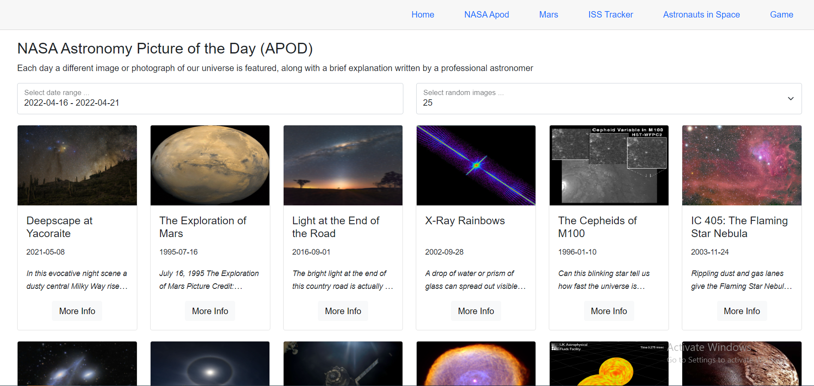
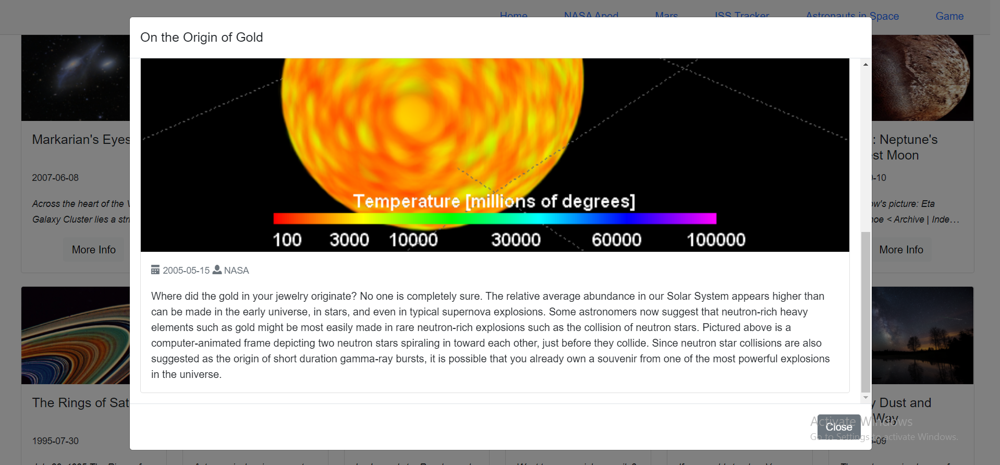

# BlazeAstro
Blazor WebAssembly with Azure Functions app for space exploration using NASA data 

https://witty-forest-0fb409703.1.azurestaticapps.net/

[](https://github.com/itplamen/testtest/actions/workflows/azure-static-web-apps-blue-water-0d6750303.yml)
[](https://dev.azure.com/itplamen/BlazeAstro/_build/latest?definitionId=3&branchName=main)
[](https://witty-forest-0fb409703.1.azurestaticapps.net//)

## Sources

* [NASA](https://api.nasa.gov/)
* [Astronauts In Space](https://www.howmanypeopleareinspacerightnow.com/)
* [Astronauts Info](https://www.spacelaunchschedule.com/)
* [ISS Tracker](https://isstracker.pl/)
* [Space Game (Developed by itplamen)](https://github.com/itplamen/itplamen.github.io)

## Build With

* [Blazor WebAssembly](https://github.com/dotnet/aspnetcore)
* [Azure Functions](https://github.com/Azure/Azure-Functions)
* [AutoMapper](https://github.com/AutoMapper/AutoMapper)
* [AngleSharp](https://github.com/AngleSharp/AngleSharp)
* [BlazorDateRangePicker](https://github.com/jdtcn/BlazorDateRangePicker)

#### Radis Cache Configuration

```sh
"UseInMemoryCache": false
docker run --name BlazeAstroDb -p5002:6379 -d redis
```

## Screenshots





